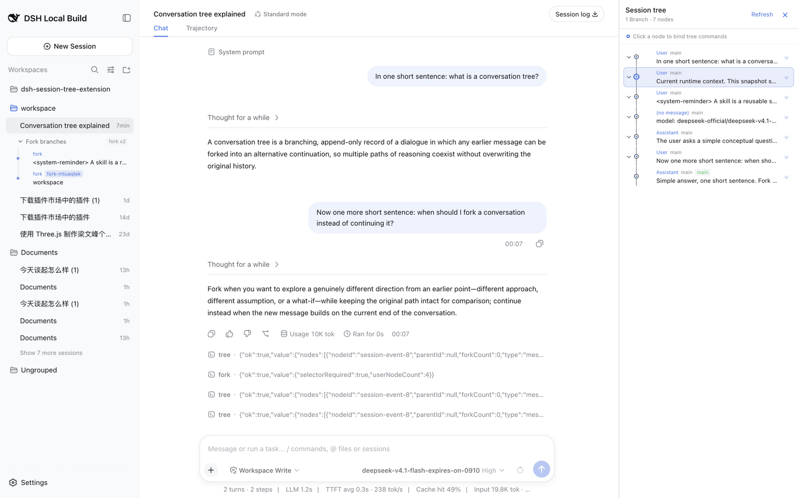
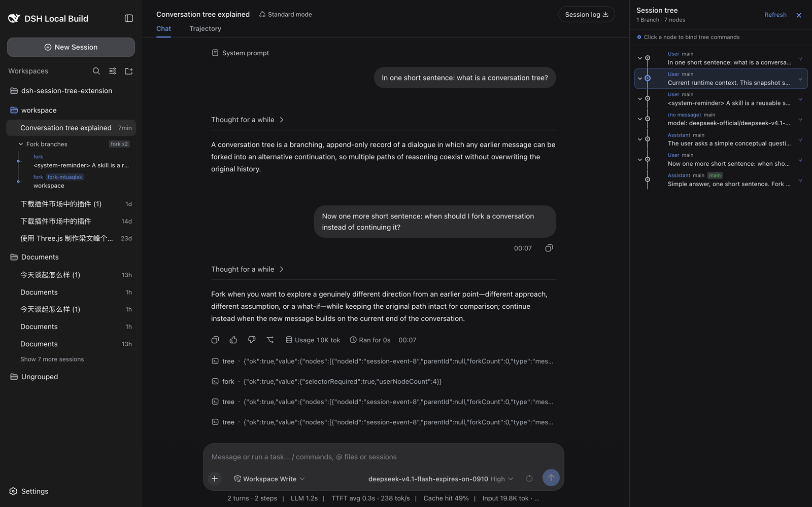
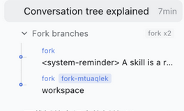

# dsh-session-tree

[](https://www.npmjs.com/package/@robiteame/dsh-session-tree)
[](https://github.com/robiteame/dsh-session-tree-extension/actions/workflows/ci.yml)
[](./LICENSE)
[](https://github.com/deepseek-ai/deepseek-harness)

Append-only, multi-branch conversation trees for
[DeepSeek-Harness](https://github.com/deepseek-ai/deepseek-harness) — fork any
historical node, clone a branch into a new session, and browse the whole tree
in a WebUI panel. Old history is never edited or deleted.

Three commands:

| Command | What it does |
|---|---|
| `/tree` | Open the session-tree panel: every node of the conversation, clickable and bindable |
| `/fork` | Branch from any historical node — the fork appears as an inline menu under its source session |
| `/clone` | Duplicate the current conversation into an independent new session under the same project |

## Screenshots

Tree panel (light and dark) with the sidebar's inline fork-branch menu:





The inline `/fork` branch menu beneath its source session:



Published as four npm packages under the `@robiteame` scope:

| Package | Role |
|---|---|
| [`@robiteame/dsh-session-tree`](./packages/bundle/session-tree) | Carrier Bundle: one install mounts everything below through its composition layer |
| [`@robiteame/dsh-pi-agent-session-tree`](./packages/extensions/pi-agent-session-tree) | Host domain service: the `SessionTree`/`SessionTreeStore` domain model and the `sessionTree` Remote |
| [`@robiteame/dsh-tool-session-tree`](./packages/extensions/tool-session-tree) | Command surface: the `/tree` `/fork` `/clone` commands |
| [`@robiteame/dsh-client-ui-session-tree`](./packages/client/ui-session-tree) | WebUI tree panel: additive right-side overlay on official builds, native details dock on patched builds |

## Install (users)

One command — from the plugin market UI, or from a Harness checkout's CLI:

```sh
dsh plugin --profile <profile> add @robiteame/dsh-session-tree
```

Prebuilt tarballs install the same way and need no build scripts:

```sh
dsh plugin --profile <profile> add robiteame-dsh-session-tree-0.2.0.tgz
```

After installing, restart the profile. The composition gains three rows
(`pi-agent-session-tree`, `tool-session-tree`, `ui-session-tree`) that load the
Host service, the commands, and the browser panel. Verify the composed layer:

```sh
dsh --profile <profile> --dump-config   # should list the three session-tree rows
```

Requires DeepSeek-Harness `0.1.2-alpha.3` (or a compatible `0.1.2` build) and
Cordis `^4.0.2`; the target installation provides those peers. No install
scripts run — the tarballs ship prebuilt `lib/` artifacts.

## The three commands

### `/tree` — open the tree panel

`/tree` opens the right-side panel listing every node of the current
conversation — user messages, assistant replies, tool calls, model switches —
each with its role, branch, and a preview. Click a node to bind it; branch
commands then operate on that node. Collapse and expand subtrees to focus on
the path you care about.

### `/fork` — branch from any historical node

`/fork` picks an earlier user prompt and grows a new branch from there: the
conversation continues along the new path while the original one stays intact.
The fork is created through the official native fork API, so it appears in the
session list with real parent linkage — the plugin renders it as an inline
collapsible menu directly beneath its source session's row, with connector
rails and per-level expand/collapse. The menu updates live from the official
reactive session list, and `/clone` children keep their ordinary sidebar
presentation.

### `/clone` — duplicate into a new session

`/clone` copies the current conversation — through its root path — into an
independent Session under the same project. The source history stays
read-only; the clone is yours to continue separately.

## Branch switching and graceful degradation

The plugin never modifies Harness core files. It capability-detects the
optional branch-selection engine API at runtime:

- **Native mode** — on a checkout carrying
  [`dev/session-branch-surface.patch`](./dev/session-branch-surface.patch)
  (`Session.selectMessageSurface()`), jump/fork switch the model-visible
  history directly: the next turn genuinely starts from the new branch.
- **Stock mode** — on an unmodified official Harness, the plugin emulates the
  switch through official append APIs (an empty `replace` surface event) plus a
  plugin-owned sidecar under `$DSH_HOME/storages/session-tree/` for durable
  branch state. The log stays resume-valid.
- **Projection mode** — if even the emulation is unavailable, navigation moves
  the tree projection and panel only, and the next turn keeps the canonical
  history.

Every mode is honest about itself: the Host log prints a one-time notice when
a session runs in a non-native mode. Move the raw `session.jsonl.zstd` between
machines together with the matching sidecar file.

## How it works

- **Append-only** — every node is immutable; branching and jumping only move
  the cursor. Old branches are never edited or deleted.
- **Every entry is a node** — messages, tool calls, model switches, compaction
  records, and branch summaries all become typed nodes; each has a unique
  `nodeId` and a `parentId` (root is `null`). A node may have multiple
  children — that is the fork.
- **Cursor navigation** — jumping moves the active leaf to a historical node;
  the next append grows a new branch from there. Sibling branches stay intact.
- **LLM context** — the model always receives the standard `messages` array
  for the root→cursor path only.

## Development (contributors)

The repository is a pnpm workspace building the three implementation packages
standalone (no Harness checkout needed):

```sh
pnpm install
pnpm verify      # build + typecheck (host & client) + pack dry-run + vitest
pnpm pack:all    # produce the four tarballs
```

Tests run against the published Harness packages (`0.1.2-alpha.3`) — the
stock-mode paths — with `vitest` from the repository root. The browser spec in
`packages/client/ui-session-tree` needs the Harness client test runtime and
runs inside a source-integrated checkout.

### Source integration against a Harness checkout

For debugging against Harness source (native mode, native details dock):

```sh
dev/install.sh /path/to/deepseek-harness     # applies both dev patches + copies packages
cd /path/to/deepseek-harness && pnpm install && pnpm run build
```

See [`dev/README.md`](./dev/README.md) for what each patch does. This flow is
for contributors only — user installs never touch a Harness checkout.

## License

MIT.
